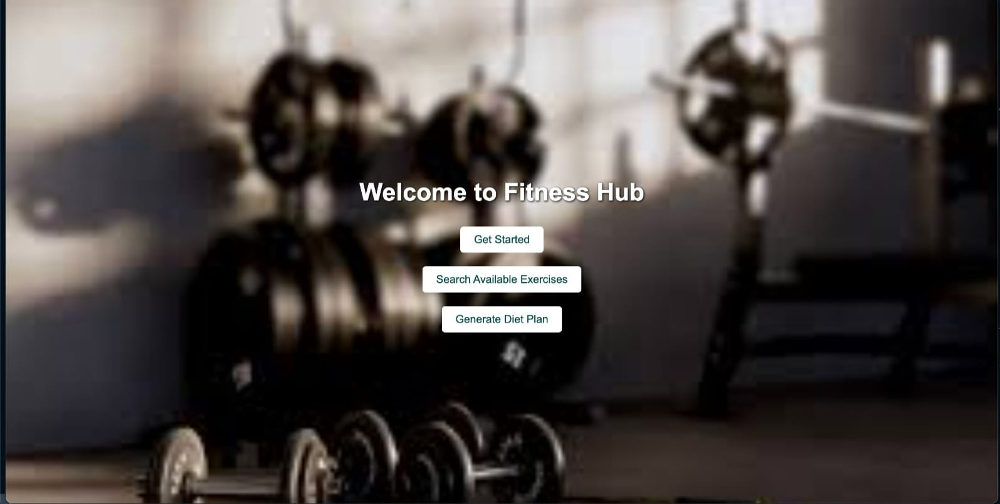
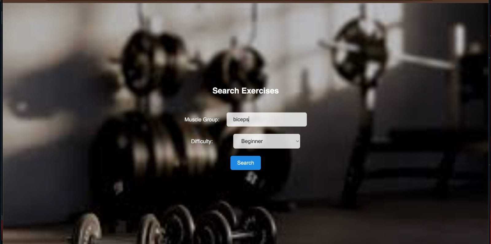
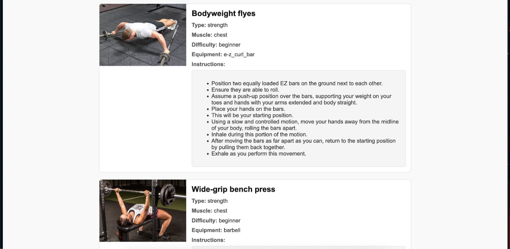
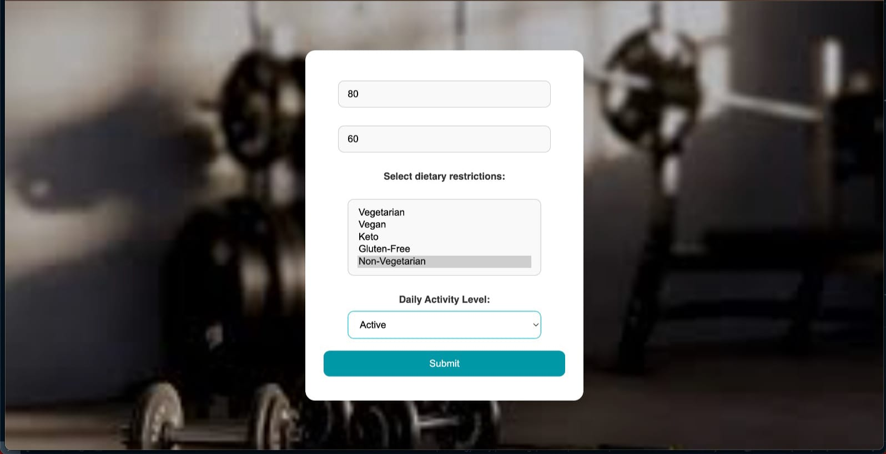
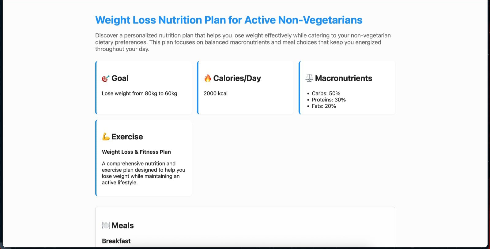

# 🏋️‍♂️ Fitness Hub

**Fitness Hub** is a lightweight fitness web application that offers users personalized **diet plans** and **exercise recommendations** based on selected muscle groups and difficulty levels. Built using **Flask**, **HTML**, and **CSS**, it serves static content without any backend database. The app is simple, responsive, and beginner-friendly — perfect for quick fitness guidance.

---

## 📸 Screenshots

### 🏠 Home Page


### 💪 Exercise Preferences Form



### 🏋️ Exercise Result Page



### 📋 Diet Preferences Page



### 🏋️ Diet Plane Page


---

## 🚀 Features

- Personalized diet plan suggestions  
- Exercise recommendations by muscle group and difficulty level  
- Responsive and user-friendly interface  
- Fully static — no backend database or login system  
- Built using Flask for routing, with HTML & CSS for UI

---

## 📝 Forms & Outputs

### 🔹 **Form 1: Diet Plan Generator**

- **Input Fields:**
  - Fitness Goal (e.g., Gain, Lose, Maintain)
  - Diet Preference (e.g., Veg / Non-Veg)

- **Output:**
  - Displays a recommended diet plan on a new page (`diet_plan.html`) based on the selected goal

---

### 🔹 **Form 2: Exercise Recommendation Tool**

- **Input Fields:**
  - Muscle Group (e.g., Arms, Chest, Legs)
  - Difficulty Level (e.g., Beginner, Intermediate, Advanced)

- **Output:**
  - Returns a list of relevant exercises with styling based on the selected options

---

## 🛠️ Tech Stack


- **Framework:** Flask (used for page routing only)  
- **Frontend:** HTML5, CSS3  
- **Data:** Static content (no backend DB or APIs)

---

## 💻 How to Run Locally

```bash
# Clone the repository
git clone https://github.com/SouvagyaCode/Fitness-Hub.git

# Navigate into the project directory
cd Fitness-Hub

# Install Flask
pip install -r requirements.txt

# Run the Flask app
python app.py

Fitness-Hub/
│
├── static/
│   ├── css/
│   └── images/
│
├── templates/
│   ├── index.html
│   └── diet_plan.html
│
├── app.py
├── requirements.txt
└── README.md
